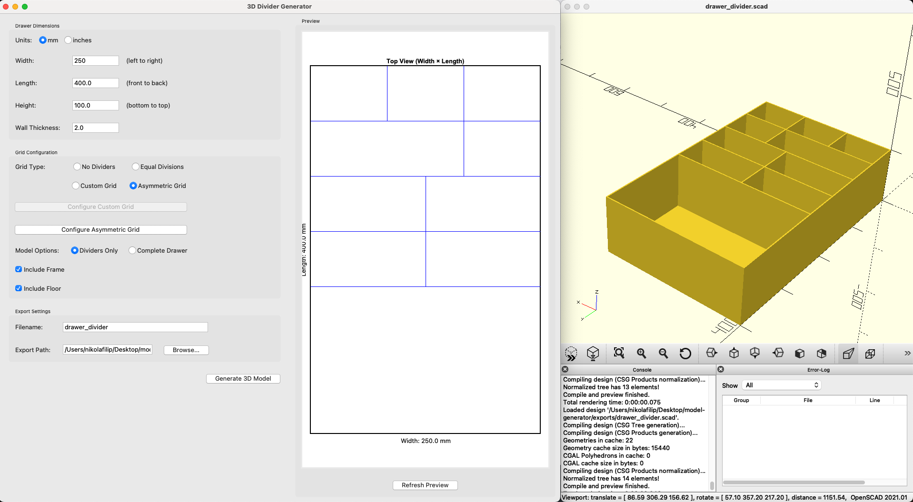

# 3D Divider Generator

A Python-based offline tool for generating 3D models of closet/drawer dividers.
This project was entirely designed and implemented using Large Language Models (LLMs), originating from a practical, real-world need: organizing drawers at home using 3D-printed dividers, without having to manually design models or learn complex CAD software. While the initial idea came from personal experience, the specific features, folder structure, software architecture, project logic, and even the development rules and guidelines were conceptualized using GPT-O3-Mini. Claude-Sonnet-3.7, running in agent mode, handled the actual implementation—turning structured inputs into working code. Much like 3D printing itself, this project involved setting clear parameters, providing the input, allowing the agent to autonomously produce results, and finally verifying the output. The purpose is to showcase the powerful potential of modern LLMs, paired with precise prompting, to quickly build practical solutions to everyday problems in just a couple of hours. We truly live in an era where tools are at hand to bring virtually any idea into reality—even this explanatory paragraph itself was authored by ChatGPT 4.5.

## Features

- Create custom dividers for closets, drawers, or any storage space
- Input custom dimensions (width, height, length) in millimeters or inches
- Configure grid layouts with preset, custom, or asymmetric section sizes
- Generate 3D models ready for printing
- Export STL files compatible with Bambu Lab printers

## Screenshots



*The main interface of the 3D Divider Generator, showing the dimension inputs, grid configuration options, and model generation settings.*

## Installation

1. Clone this repository:
```bash
git clone https://github.com/yourusername/model-generator.git
cd model-generator
```

2. Create and activate a virtual environment:
```bash
python -m venv venv
source venv/bin/activate  # On Windows: venv\Scripts\activate
```

3. Install dependencies:
```bash
pip install -r requirements.txt
```

4. Install OpenSCAD (required for generating 3D models):
   - For macOS: `brew install --cask openscad`
   - For Windows: Download and install from [OpenSCAD website](https://openscad.org/downloads.html)
   - For Linux: `sudo apt install openscad` or equivalent for your distribution

5. For macOS users with Apple Silicon (M1/M2/M3):
   - Install Rosetta 2 to run OpenSCAD (Intel app): `softwareupdate --install-rosetta --agree-to-license`
   - Open OpenSCAD manually once before using the tool to ensure it's properly set up

## Usage

1. Run the application:
```bash
python src/main.py
```

2. Input your drawer dimensions:
   - Width, Length, Height: These define the outer dimensions of your drawer
   - Divider Thickness: Thickness of the divider walls
   - You can use imperial units by appending "in" (e.g., "3.5in") or metric by default

3. Configure your grid layout:
   - No Dividers: Create a drawer without any internal dividers
   - Equal Divisions: Choose from predefined grid patterns (2×2, 3×3, etc.)
   - Custom Grid: Create a custom grid with specified row and column percentages
   - Asymmetric Grid: Create an advanced grid where each row can have:
     - A custom height (as a percentage of total grid height)
     - A unique number of columns, each with custom widths
   
4. Choose Model Options:
   - Dividers Only: Generate just the dividers (with optional frame)
   - Complete Drawer: Generate a complete drawer with dividers
   - Include Frame: Add an outer frame around the dividers
   - Include Floor: Add a bottom to the dividers

5. Configure Export Settings:
   - Filename: Name of the output file
   - Export Directory: Where to save the generated files
   - Resolution: Quality of the STL file (low/normal/high)

6. Click "Generate" to create your 3D model
   - On macOS, OpenSCAD will open automatically to help export as STL
   - Follow the on-screen instructions to save the STL file
   - For other platforms, the STL will be generated automatically

7. Use the STL file for 3D printing with your 3D printer

## Using the Asymmetric Grid Feature

The Asymmetric Grid feature allows for creating complex divider layouts where:

1. Each row can have a different height (specified as a percentage of total height)
2. Each row can have a different number of columns
3. Each column can have a custom width (as a percentage of row width)

To use this feature:

1. Select "Asymmetric Grid" in the Grid Type options
2. Click "Configure Asymmetric Grid" to open the configuration dialog
3. Set the number of rows and click "Update Rows"
4. For each row:
   - Set the height percentage (all rows must sum to 100%)
   - Set the number of columns for that row
   - Click "Configure Columns" to set the width percentages for each column (must sum to 100%)
5. Click "Apply" to save your grid configuration
6. Generate your model as usual

This allows for creating complex organizers with different compartment sizes optimized for specific items.

## Troubleshooting

### OpenSCAD Issues
- **OpenSCAD Not Opening**: Install OpenSCAD using `brew install --cask openscad` (macOS) or download from the OpenSCAD website
- **STL Export Fails**: Open the generated SCAD file manually with OpenSCAD and export as STL
- **Command-line Issues**: macOS users should install Rosetta 2 and open OpenSCAD once manually

### UI Issues
- **Custom Grid Editor**: When creating many rows/columns, use the scroll wheel to navigate
- **Preview Not Showing**: The preview feature is under development

### Error Messages
- **Dimension Error**: Check that your input dimensions are valid (positive numbers within limits)
- **Grid Error**: Ensure your custom grid percentages sum to approximately 100%
- **Export Error**: Check that OpenSCAD is installed and the export directory is writable

## Development

### Project Structure
- `src/` - Source code
  - `ui/` - User interface components
  - `logic/` - Business logic modules
  - `config/` - Configuration files
- `tests/` - Test files
- `exports/` - Generated files (STL and SCAD)

### Running Tests
```bash
pytest
```

### Code Style
This project follows PEP 8 style guidelines.

## License

MIT License